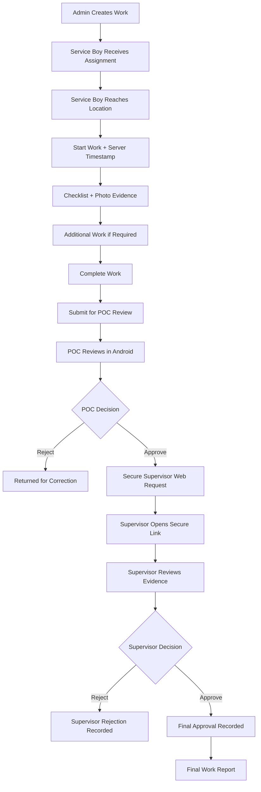
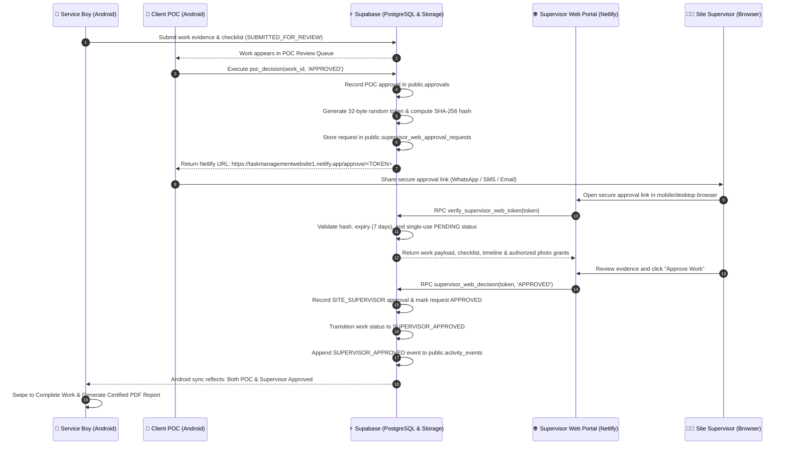

<div align="center">

# 🛠️ Field Service Management System

**A production-grade field operations platform for work assignment, location-verified execution, checklist tracking, photo evidence, multi-stage approvals, secure Supervisor Web Approval, audit trails, and authoritative PDF reporting.**

[](https://developer.android.com)
[](https://kotlinlang.org)
[](https://developer.android.com/jetpack/compose)
[](https://m3.material.io)
[](https://supabase.com)
[](https://www.postgresql.org)
[](https://react.dev)
[](https://www.typescriptlang.org)
[](https://vitejs.dev)
[](https://www.netlify.com)

<br>

> 🟢 **Production Workflow Ready**
>
> **Android Field App** + **Supabase Backend (PostgreSQL, Auth & Storage)** + **Supervisor Web Portal**
>
> 🌐 **Production Supervisor Portal**: [https://taskmanagementwebsite1.netlify.app/](https://taskmanagementwebsite1.netlify.app/)

<p align="center">
  <b>Empowering Admins, Field Technicians, Client POCs, and Site Supervisors through real-time operational sync, location validation, verifiable photo evidence, cryptographic approvals, and immutable audit logs.</b>
</p>

[Overview](#-overview) • [Key Features](#-key-features) • [Lifecycle & Workflows](#-task-lifecycle--approval-workflow) • [Supervisor Web Portal](#-supervisor-web-approval-portal) • [Supervisor Web Architecture](#-secure-supervisor-approval-architecture) • [Role Matrix](#-role-based-matrix) • [Demo Accounts](#-demo-accounts) • [Architecture](#-tech-stack--architecture) • [Getting Started](#-getting-started) • [Tests](#-running-tests)

---

</div>

## 📖 Overview

The **Field Service Management System** is an end-to-end, enterprise-ready operations platform that synchronizes field service execution with multi-tier managerial governance. Designed to eliminate unstructured messaging, manual paperwork, and untracked job completion, the platform unifies four distinct operational stakeholders into an immutable, verifiable workflow:

$$\text{Admin} \xrightarrow{\text{Work Creation}} \text{Technician} \xrightarrow{\text{GPS \& Execution}} \text{POC} \xrightarrow{\text{Sign-off}} \text{Supervisor (Web)} \xrightarrow{\text{Final Approval}} \text{Certified PDF}$$

### Core Platform Principles
* **Accountability & Integrity**: Server-authoritative state transitions prevent technicians from skipping tasks, submitting empty evidence, or self-approving work.
* **Location-Verified Operations**: Haversine radius validation ensures technicians are physically on-site before initiating work.
* **Cryptographic Multi-Stage Sign-Off**: Client POC reviews and approves on Android, automatically generating a high-entropy, SHA-256 hashed single-use token for the Site Supervisor's Web Portal sign-off.
* **Persistent Session Management**: Secure token persistence via Android Jetpack DataStore preserves sessions across app restarts without ever saving plain-text credentials.
* **Authoritative Timestamping**: Every milestone is timestamped in `Asia/Kolkata` time (`dd MMM yyyy, hh:mm a`) and recorded in a centralized audit timeline (`public.activity_events`).
* **Certified Reporting**: Automatic multi-page PDF generation embeds client logos, metadata, supervisor web approval credentials, and high-resolution photo evidence directly from Supabase Storage.

---

## 🚀 Key Features

### 👷 Service Boy / Field Technician
* **Assigned Work Dashboard**: Prioritized daily agenda with client company names, addresses, scheduled dates, and proximity metrics.
* **Turn-by-Turn Navigation**: One-tap launch into Google Maps with validated client GPS coordinates and address fallback.
* **Geofence Verification**: Real-time GPS accuracy check verifying technician location within authorized radius before permitting work execution.
* **Swipe-to-Start Work**: Haptic swipe confirmation executing server-authoritative `start_work()` RPC.
* **Dynamic Predefined Checklist**: Interactive task execution with completion timestamps, technician identification, and persistent state.
* **Additional Work Reporting**: On-the-fly logging of extra out-of-scope tasks with dedicated descriptions and master task linkages.
* **Actual Photo Evidence Capture**:
  * Real device camera capture and gallery selection with automatic dimension and quality compression.
  * Evidence categorized into *Site Inspection*, *Treatment Application*, *Equipment Check*, *Safety & PPE*, and *Additional Work*.
  * Direct upload to private Supabase Storage bucket (`work-photos`).
  * Full-screen interactive lightbox viewer with metadata and zoom.
* **Swipe-to-Complete & Submit**: Prevents submission until all required checklist items are ticked and photo evidence is uploaded.
* **Persistent State & Offline Sync**: Full local cache recovery (`WorkLocalCache`) ensuring work in progress survives app closing, device restarts, and network drops.

### 👨‍💼 Administrator
* **Work Creation Engine**: Rapid task assignment selecting verified client companies from the `companies_master` catalog.
* **Master Task Catalog**: Enforces standardized predefined checklist items, eliminating ad-hoc typos and unapproved work scopes.
* **Technician Availability Tracking**: Real-time `FREE` vs `BUSY` indicator preventing over-scheduling of active technicians.
* **Newest-First Work Ordering**: Authoritative sorting (`created_at DESC, id DESC`) ensures newly created work immediately appears at index 0 (top of the work list).
* **Multi-Metric Dashboard**: Real-time counters for *Total Works*, *In Progress*, *Under Review*, and *Completed*.
* **Search & Status Filtering**: Instant client, technician, and title filtering across status tabs (*All*, *In Progress*, *In Review*, *Approved*, *Completed*).

### 🏢 Client Point of Contact (POC)
* **Dedicated Review Dashboard**: Immediate visibility into work orders submitted for facility review.
* **Inspection Room**: Complete inspection of completed checklist tasks, additional work items, operational notes, and high-res evidence photos.
* **Authoritative POC Approval**: Atomically records approval, logs audit events, transitions work to `POC_APPROVED`, and generates the Supervisor Web Approval Request.
* **Duplicate Approval Protection**: Idempotent RPC prevents repeated approvals, reusing active tokens and protecting system integrity.
* **Clear State Feedback**: Displays `✓ POC APPROVED` banner and `Supervisor Web Approval Pending` status, replacing the swipe button permanently.
* **Secure Link Sharing**: One-tap `[ COPY LINK ]` and `[ OPEN LINK ]` buttons displaying the authoritative Netlify Supervisor URL (`https://taskmanagementwebsite1.netlify.app/approve/<SECURE_TOKEN>`).
* **Rejection with Mandatory Reason**: Enforces mandatory written explanations when requesting revisions, notifying the technician immediately.

### 🌐 Site Supervisor (Web Approval Portal)
* **Zero Mobile App Footprint**: Supervisors do not need the mobile app installed; they access a dedicated responsive Web Portal built with React, TypeScript, and Vite.
* **Production Deployed on Netlify**: [https://taskmanagementwebsite1.netlify.app/](https://taskmanagementwebsite1.netlify.app/)
* **Direct Deep-Link Access**: Every work generates a unique approval route: `https://taskmanagementwebsite1.netlify.app/approve/<SECURE_TOKEN>`.
* **Complete Web Review Suite**:
  * Comprehensive work summary (Title, Company, Scheduled Date, Address).
  * Stakeholder personnel roster (Service Boy, Client POC, Site Supervisor).
  * POC Approval verification badge with timestamp.
  * Interactive assigned checklist and additional work lists.
  * Full chronological activity audit timeline.
  * Photo evidence gallery with secure authorized image viewing.
* **One-Click Decision**: Approve work or reject with mandatory comments.
* **Standardized Timezone**: All timestamps formatted strictly in `Asia/Kolkata` (`dd MMM yyyy, hh:mm a`).
* **Clean Confirmation**: Certified success page with Work Order summary, approval method (`WEB`), and immutable audit trail.

---

## 🔄 Task Lifecycle & Approval Workflow



---

## 🌐 Supervisor Web Approval Portal

The application uses a separate secure web portal for Site Supervisor approval, completely decoupling administrative governance and sign-off from mobile client installations.

### Approval Workflow

```
Service Boy
   ↓
Work Completed
   ↓
POC Review
   ↓
POC Approval
   ↓
Secure Web Approval Request
   ↓
Site Supervisor receives secure approval link
   ↓
Supervisor opens link in any browser/device
   ↓
Reviews work evidence
   ↓
Approve / Reject
   ↓
Final authoritative status + report
```

### Key Architectural & Security Specifications

- **Zero Mobile App Dependency**: Site Supervisors do **NOT** use the Android application for final approval.
- **Standalone Web Portal**: Supervisor approval is performed exclusively through the standalone web portal.
- **No Mobile Login Required**: No Supervisor mobile login or account credentials are required.
- **Secure Random Token**: The approval link contains a secure random 256-bit token (`https://taskmanagementwebsite1.netlify.app/approve/<SECURE_TOKEN>`).
- **Cryptographic Hash Storage**: The raw token is never stored directly in the database; the backend stores a SHA-256 hash of the token (`token_hash`).
- **Strict Token Expiry**: Every approval request has an automatic 7-day expiration window.
- **Server-Side Token Validation**: The portal validates the token via PostgreSQL stored procedure (`verify_supervisor_web_token`) before exposing any work information.
- **Server-Side Recorded Decisions**: Supervisor decisions are recorded server-side via atomic database RPCs (`supervisor_web_decision`).
- **Comprehensive Review Suite**: The portal provides access to:
  - **Work & Location**: Work title, scheduled date, company name, address, and GPS coordinates.
  - **Personnel**: Service Boy, Client POC, and Site Supervisor identities.
  - **POC Approval**: Verified POC approval status and exact timestamp.
  - **Checklist**: Mandatory task execution and completion statuses.
  - **Additional Work**: Out-of-scope work logged with descriptions and categories.
  - **Activity Timeline**: Full chronological audit trail of events.
  - **Photo Evidence**: High-resolution before/after and inspection photos.
- **Secure Photo Storage**: Photo evidence uses secure/private storage access via token-authorized access grants (`supervisor_photo_access_grants`).
- **Authoritative Audit Trail**: Supervisor approval/rejection becomes part of the authoritative, immutable audit trail (`public.activity_events`).

### 🔗 Web Portal Repository

[Task Management Website](https://github.com/Prasad2123/Task-Management-Website)

**Technology**:
- React
- TypeScript
- Vite
- Supabase
- Tailwind CSS
- React Router
- TanStack Query
- Lucide Icons
- Framer Motion

**Production**:
- **Production Website**: [Open Supervisor Approval Portal](https://taskmanagementwebsite1.netlify.app/)
- **Approval URL Pattern**: `https://taskmanagementwebsite1.netlify.app/approve/<SECURE_TOKEN>`

---

## 🔐 Secure Supervisor Approval Architecture

The final sign-off uses a cryptographically secure token mechanism that decouples Supervisor approval from mobile app credentials:



### Key Security Properties
1. **Zero Password Requirement**: Supervisors authenticate via high-entropy (256-bit) single-use cryptographic tokens.
2. **SHA-256 Token Hashing**: Raw tokens are never stored plain-text in the database; only SHA-256 hashes are persisted.
3. **Single-Use & Expiry Guards**: Links expire after 7 days and can only be decided once (`PENDING` $\rightarrow$ `APPROVED` or `REJECTED`).
4. **Prerequisite Enforcement**: `supervisor_web_decision` fails with an exception if valid POC approval does not exist.
5. **Authorized Photo Access**: Private bucket photos are secured via temporary access tokens and authorized RPC policies.

---

## 👥 Role-Based Matrix

| Role | Platform | Responsibilities |
|------|----------|------------------|
| Admin | Android | Create and manage work |
| Service Boy | Android | Execute assigned work, checklist, photos, completion |
| POC | Android | Review submitted work and approve/reject |
| Site Supervisor | Web Portal | Final approval/rejection through secure link |

### Detailed Capabilities Comparison

| Feature / Capability | 👨‍💼 Admin | 👷 Service Boy | 🏢 Client POC | 🌐 Site Supervisor |
|:---|:---:|:---:|:---:|:---:|
| **Primary Interface** | Android App | Android App | Android App | Web Portal (Netlify) |
| **Authentication Method** | Supabase Auth (Email/PW) | Supabase Auth (Email/PW) | Supabase Auth (Email/PW) | Secure Cryptographic Link |
| **Session Persistence** | Jetpack DataStore | Jetpack DataStore | Jetpack DataStore | Token Session |
| **Create Work & Assign Tasks** | ✅ | ❌ | ❌ | ❌ |
| **View Fleet Availability (Free/Busy)** | ✅ | ❌ | ❌ | ❌ |
| **Newest-First Work Ordering** | ✅ (`created_at DESC`) | ✅ (`created_at DESC`) | ✅ (`created_at DESC`) | 👁️ Single Order View |
| **Turn-by-Turn GPS Navigation** | ❌ | ✅ (Google Maps) | ❌ | ❌ |
| **Haversine Geofence Verification** | ❌ | ✅ | ❌ | ❌ |
| **Execute & Toggle Checklist** | ❌ | ✅ | 👁️ (View Only) | 👁️ (View Only) |
| **Log Ad-hoc Additional Work** | ❌ | ✅ | 👁️ (View Only) | 👁️ (View Only) |
| **Capture & Upload Photos** | ❌ | ✅ (Direct to Bucket) | 👁️ (View Only) | 👁️ (View Only) |
| **Submit Work for Verification** | ❌ | ✅ | ❌ | ❌ |
| **First-Level POC Sign-Off** | ❌ | ❌ | ✅ (Android App) | ❌ |
| **Receive Supervisor Web URL** | ❌ | ❌ | ✅ (Displays Link) | 📥 (Opens Link) |
| **Final Supervisor Web Sign-Off** | ❌ | ❌ | ❌ | ✅ (Web Portal) |
| **Generate Multi-Page Certified PDF** | ✅ | ✅ | ❌ | ❌ |

---

## 🔑 Demo Accounts

The system includes pre-provisioned demo accounts across all supported roles:

| Role | Interface | Email Address | Password | Demo Name | Primary Responsibilities |
|:---|:---|:---|:---|:---|:---|
| **Administrator** | Android App | `admin@demo.com` | `demo1234` | Admin User | Work Creation, Master Task Assignment, Fleet Availability Monitoring |
| **Service Boy** | Android App | `service@demo.com` | `demo1234` | Rahul Patil | On-site Execution, Checklist Completion, Photo Evidence Upload |
| **Client POC** | Android App | `poc@demo.com` | `demo1234` | Amit Sharma | On-site Inspection, Checklist/Photo Verification, First-Level POC Approval |
| **Site Supervisor** | Web Portal | N/A | Secure Link | Suresh Patil | External Web Portal Audit, Secondary Sign-Off, Quality Closure |

> [!TIP]
> **Complete End-to-End Walkthrough**:
> 1. **Login as Admin** (`admin@demo.com` / `demo1234`): Create a new work order for *Company A*, assign master tasks, and assign to *Rahul Patil*. Verify the new work appears immediately at the **top** of the list.
> 2. **Login as Service Boy** (`service@demo.com` / `demo1234`): Open the assigned work, verify location, swipe to start, complete checklist tasks, capture/upload evidence photos, and swipe to submit.
> 3. **Login as Client POC** (`poc@demo.com` / `demo1234`): Open the review queue, inspect evidence, and tap approve. The screen transitions to `✓ POC APPROVED` and generates the Supervisor Netlify approval link.
> 4. **Open Supervisor Portal**: Tap `[ OPEN LINK ]` or copy `https://taskmanagementwebsite1.netlify.app/approve/<TOKEN>` in your browser. Review evidence and approve.
> 5. **Complete Work & PDF**: Return to the Service Boy account. Both approvals will reflect `APPROVED`. Tap Complete Work and generate the authoritative PDF report!

---

## 🛠️ Tech Stack & Architecture

### High-Level System Architecture

```
┌────────────────────────────────────────────────────────┐
│               Client Applications Layer                │
│                                                        │
│   ┌──────────────────────────┐  ┌────────────────────┐ │
│   │   Android Mobile App     │  │ Supervisor Web App │ │
│   │   (Kotlin / Compose)     │  │ (React / TS / Vite)│ │
│   └────────────┬─────────────┘  └─────────┬──────────┘ │
└────────────────┼──────────────────────────┼────────────┘
                 │ HTTPS / REST             │ HTTPS / REST
                 ▼                          ▼
┌────────────────────────────────────────────────────────┐
│           Supabase Cloud Backend Platform              │
│                                                        │
│  ┌────────────────────────┐  ┌───────────────────────┐ │
│  │     Supabase Auth      │  │   PostgREST API Engine│ │
│  │ (JWT Tokens & Refresh) │  │  (RPCs & Table Access)│ │
│  └────────────────────────┘  └───────────┬───────────┘ │
│                                          │             │
│  ┌───────────────────────────────────────▼───────────┐ │
│  │               PostgreSQL Database                 │ │
│  │  • works, approvals, users, companies, checklists │ │
│  │  • supervisor_web_approval_requests               │ │
│  │  • Row Level Security (RLS) Policies              │ │
│  │  • Server Functions (poc_decision, etc.)          │ │
│  └───────────────────────────────────────────────────┘ │
│                                                        │
│  ┌───────────────────────────────────────────────────┐ │
│  │               Supabase Storage                    │ │
│  │  • Private work-photos bucket (Token-Authorized)  │ │
│  └───────────────────────────────────────────────────┘ │
└────────────────────────────────────────────────────────┘
```

### Project Directory Structure

```
TaskManagementApplication/
├── app/                                  # Android Application (Kotlin / Compose)
│   ├── src/main/java/.../
│   │   ├── admin/ui/                     # Admin dashboard & work creation sheets
│   │   ├── auth/                         # Authentication UI & ViewModels
│   │   ├── core/
│   │   │   ├── model/                    # Domain models (Work, User, Checklist, Photo)
│   │   │   ├── navigation/               # AppNavHost, routes, session-aware start
│   │   │   ├── network/                  # AuthEventBus, NetworkModule
│   │   │   ├── theme/                    # Material 3 typography, colors, shapes
│   │   │   └── ui/                       # Stepper, SwipeActionButton, NetworkStatusBar
│   │   ├── data/
│   │   │   ├── dto/                      # Moshi DTOs for Supabase REST & RPCs
│   │   │   ├── local/                    # TokenManager (Jetpack DataStore auth_prefs)
│   │   │   ├── network/                  # ApiService Retrofit interface
│   │   │   └── repository/               # WorkRepository & AuthRepository
│   │   ├── home/ui/                      # Service Boy & POC Home dashboards
│   │   ├── review/ui/                    # PocReviewScreen (with Netlify link controls)
│   │   ├── splash/                       # Animated splash screen with auto-restore
│   │   └── work/                         # Work checklist, photos, report generator
│   └── src/test/                         # 10 comprehensive JUnit4 unit test suites
├── supabase/
│   └── migrations/                       # Idempotent PostgreSQL DDL & RPC migrations
└── Task Management Website/              # Supervisor Web Portal (React / TS / Vite)
    ├── src/
    │   ├── components/                   # Review cards, headers, photo grid
    │   ├── lib/                          # Asia/Kolkata dateUtils, geoUtils, supabase
    │   ├── pages/                        # ReviewPage, SuccessPage, RejectedPage
    │   └── tests/                        # Vitest test suites
    └── public/
        └── _redirects                    # Netlify SPA history rewrite rule
```

### Technology Matrix
* **Android Client**:
  * **Language & Runtime**: Kotlin 2.0, Java 17, Coroutines, StateFlow.
  * **UI Framework**: Jetpack Compose with Material Design 3 (M3).
  * **Architecture**: Clean Architecture + MVVM + Unidirectional Data Flow.
  * **Networking**: Retrofit 2, OkHttp 3, Moshi (Reflection & Codegen).
  * **Storage & Persistence**: AndroidX Jetpack DataStore Preferences (`auth_prefs`), local cache.
  * **Image Pipeline**: Coil Compose with custom OkHttp signed URL resolver.
  * **PDF Generation**: Native Android `PdfDocument` engine with custom A4 canvas drawing.
* **Backend (Supabase)**:
  * **Database**: PostgreSQL with Row Level Security (RLS) enabled on all public tables.
  * **Authentication**: Supabase Auth issuing verifiable JWTs.
  * **APIs**: PostgREST endpoints + `SECURITY DEFINER` stored procedures.
  * **Storage**: Private `work-photos` bucket protected by token-authorized RLS policies.
* **Supervisor Web Portal**:
  * **Framework**: React 18, TypeScript, Vite.
  * **Styling**: Tailwind CSS + Lucide React icons.
  * **Routing**: React Router v6 with Netlify SPA rewrites (`/* /index.html 200`).
  * **Deployment**: Netlify Production ([taskmanagementwebsite1.netlify.app](https://taskmanagementwebsite1.netlify.app/)).

---

## 💻 Getting Started

### Android Project Setup

#### Prerequisites
* **Android Studio**: Ladybug (2024.2.1) / Koala / Hedgehog or newer
* **JDK**: OpenJDK 17
* **Android SDK**: Compile SDK 36, Min SDK 25 (Android 7.1+)

#### Steps
1. **Clone the Repository**:
   ```bash
   git clone https://github.com/Prasad2123/Task-Management-Application.git
   cd Task-Management-Application
   ```
2. **Open in Android Studio**:
   * Select **File** $\rightarrow$ **Open...** and select `TaskManagementApplication`.
3. **Sync Gradle**:
   * Allow Gradle to download dependencies specified in `gradle/libs.versions.toml`.
4. **Run the App**:
   * Launch on an Android Emulator or connected physical device via **Run ▶** (`Shift + F10`).

---

### Supervisor Web Portal Setup

#### Prerequisites
* **Node.js**: v18 or newer
* **Package Manager**: npm or pnpm

#### Steps
1. **Clone or Navigate to Web Portal Directory**:
   ```bash
   git clone https://github.com/Prasad2123/Task-Management-Website.git
   cd Task-Management-Website
   ```
2. **Install Dependencies**:
   ```bash
   npm install
   ```
3. **Start Local Dev Server**:
   ```bash
   npm run dev
   ```
4. **Build for Production**:
   ```bash
   npm run build
   ```

---

## 🧪 Running Tests

### Android Unit Tests
Execute the complete JUnit test suite validating business rules, location checks, photo uploads, admin sorting, and approval flows:
```powershell
.\gradlew.bat test
```

Assemble production debug APK:
```powershell
.\gradlew.bat assembleDebug
```

### Supervisor Web Portal Tests
Run the Vitest test suites verifying date formatting (`Asia/Kolkata`), distance utilities, and notification payloads:
```powershell
cd Task-Management-Website
npm test
```

---

## 📄 License

This project is licensed under the terms of the [MIT License](LICENSE).

---

<div align="center">
  <sub>Crafted with ❤️ by <a href="https://github.com/Prasad2123">Prasad Pilke</a></sub>
</div>
