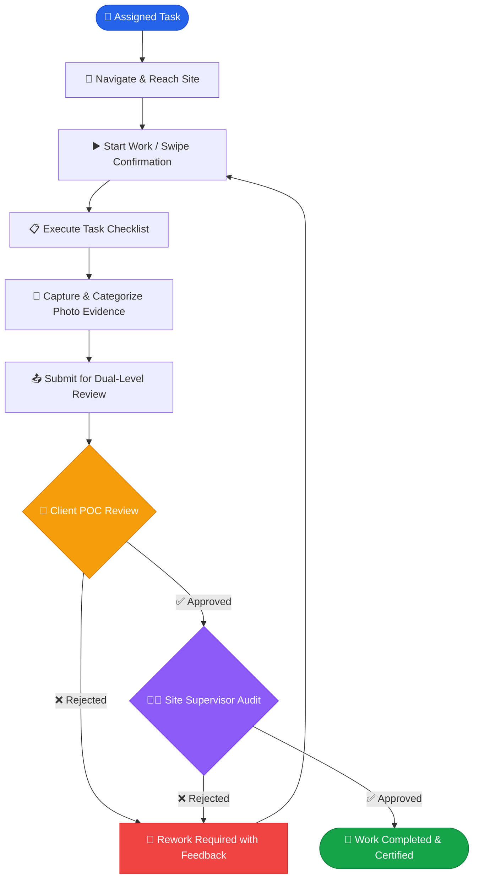

<div align="center">

# 🛠️ Field Service — Task Management Application

**A modern, production-grade Android field service & task management system built with Jetpack Compose, Material 3, and Clean MVVM Architecture.**

[](https://developer.android.com)
[](https://kotlinlang.org)
[](https://developer.android.com/jetpack/compose)
[](https://m3.material.io)
[](https://developer.android.com)
[](https://developer.android.com)

<p align="center">
  <b>Seamlessly connecting Field Technicians, Client POCs, and Site Supervisors through real-time task tracking, multimedia evidence collection, and multi-tier approval workflows.</b>
</p>

[Key Features](#-key-features) • [Workflow Diagram](#-task-lifecycle--approval-workflow) • [Role Capabilities](#-role-based-matrix) • [Tech Stack](#-tech-stack--architecture) • [Demo Credentials](#-demo-accounts) • [Getting Started](#-getting-started)

---

</div>

## 📖 Overview

The **Field Service & Task Management Application** streamlines end-to-end field operations. It replaces messy paperwork and disorganized messaging apps with a synchronized, role-based mobile experience designed specifically for on-site technicians, client representatives (POCs), and operational supervisors.

From navigating to client premises with native Google Maps routing to capturing time-stamped photo evidence and securing dual-level sign-offs, this app provides accountability, transparency, and speed at every stage of work execution.

---

## 🚀 Key Features

### 👷 For Field Service Technicians
* **Interactive Work Dashboard**: View assigned jobs categorized with priority badges, client details, scheduled time slots, and proximity distances.
* **Turn-by-Turn Navigation**: Direct one-tap launch into Google Maps with pre-encoded client geo-coordinates and address search fallback.
* **Progress Stepper & Checklist**: Dynamic milestone progress stepper (`Location` → `Checklist` → `Photos` → `Review` → `Complete`).
* **Dynamic Checklists**: Pre-configured task items with real-time toggle states, completion timestamps, and ability to add custom ad-hoc tasks on the fly.
* **Categorized Photo Evidence**:
  * Upload proof categorized into *Site Inspection*, *Treatment Application*, *Equipment Check*, *Safety & PPE*, and *Additional Work*.
  * Simulated upload progress indicators and status badges.
  * Full-screen dialog viewer with interactive zoom and metadata preview.
* **Swipe-to-Action Gestures**: Sleek swipe-to-start and swipe-to-complete confirmation buttons preventing accidental status changes.
* **Live Review Tracker**: Track multi-stage approval status (POC Review & Supervisor Audit) with real-time timeline updates.

### 🏢 For Client Point of Contact (POC)
* **Pending Reviews Dashboard**: Immediate visibility into work submitted by field service technicians at client facilities.
* **Inspection Room**: Review completed checklist items, inspect high-resolution evidence photos, and read technician operational notes.
* **One-Click Decision Workflow**: Instantly approve work orders or reject with mandatory detailed feedback reasons.

### 👨‍💼 For Site Supervisors
* **Operational Control Center**: High-level overview of team performance, pending approvals, and active tasks across all service boys.
* **Audit & Final Sign-Off**: Comprehensive review of technician work logs, photo galleries, and client POC remarks before closing out tasks.
* **Detailed Activity Logs**: Chronological timeline of events from departure to final sign-off with accurate timestamps.

---

## 🔄 Task Lifecycle & Approval Workflow



---

## 👥 Role-Based Matrix

| Feature / Capability | 👷 Service Boy | 🏢 Client POC | 👨‍💼 Supervisor |
|:----------------------|:--------------:|:-------------:|:---------------:|
| View Assigned Work Orders | ✅ | ❌ | ✅ |
| Navigation via Google Maps | ✅ | ❌ | ❌ |
| Start / Stop Task Timers | ✅ | ❌ | ❌ |
| Update Checklists & Add Items | ✅ | 👁️ (View Only) | 👁️ (View Only) |
| Upload & Categorize Photos | ✅ | 👁️ (View Only) | 👁️ (View Only) |
| Submit Work for Verification | ✅ | ❌ | ❌ |
| First-Level POC Approval | ❌ | ✅ | 👁️ (Monitored) |
| Final Supervisor Sign-Off | ❌ | ❌ | ✅ |
| Real-time Notification Feed | ✅ | ✅ | ✅ |

---

## 🔑 Demo Accounts

The application includes built-in mock authentication with pre-populated tasks, checklists, and photo records for instant evaluation:

| Role | Email Address | Password | Name |
|:-----|:--------------|:---------|:-----|
| **Service Boy (Technician)** | `service@demo.com` | `password` | Rahul Patil |
| **Point of Contact (POC)** | `poc@demo.com` | `password` | Amit Sharma |
| **Site Supervisor** | `supervisor@demo.com` | `password` | Suresh Patil |

> [!TIP]
> Log in as **Rahul Patil** (`service@demo.com`) to experience starting a job, marking checklists, and uploading photos. Then log in as **Amit Sharma** (`poc@demo.com`) to approve the submission!

---

## 🛠️ Tech Stack & Architecture

```
TaskManagementApplication/
├── app/
│   ├── src/main/
│   │   ├── java/.../taskmanagementapplication/
│   │   │   ├── auth/           # Login & session state management
│   │   │   ├── core/           # Design system, models, utilities & navigation
│   │   │   │   ├── mock/       # Local mock data repositories
│   │   │   │   ├── model/      # User, Work, Checklist & Photo data classes
│   │   │   │   ├── navigation/ # Navigation graph & route definitions
│   │   │   │   ├── theme/      # Material 3 Color palette, Typography & Shape tokens
│   │   │   │   ├── ui/         # Reusable widgets (Steppers, Swipe Buttons, Cards)
│   │   │   │   └── util/       # Google Maps intent handlers & helpers
│   │   │   ├── home/           # Role-tailored dashboard screens
│   │   │   ├── review/         # POC & Supervisor approval review portals
│   │   │   ├── splash/         # Modern splash presentation
│   │   │   └── work/           # Work details, checklist, photos & completion flows
│   │   └── res/                # Vector drawables, themes, and app resources
│   └── build.gradle.kts
└── gradle/                     # Version catalogs & wrapper scripts
```

### Technology Highlights
* **Language**: 100% Kotlin with Coroutines and StateFlow.
* **Modern Android UI**: Declarative Jetpack Compose using Material Design 3 (M3).
* **Architecture**: Clean Architecture + MVVM (Model-View-ViewModel) with unidirectional data flow (UDF).
* **Navigation**: Jetpack Navigation Compose with type-safe route parameters.
* **Componentry**:
  * Custom `SwipeActionButton` with threshold detection.
  * Multi-step `WorkProgressStepper`.
  * Fully categorized `PhotoCard` and `PhotoViewerDialog`.
  * Resilient Google Maps intent launcher with automatic fallback.
* **Gradle Version Catalog**: Centralized dependency management via `libs.versions.toml`.

---

## 💻 Getting Started

### Prerequisites
* **Android Studio**: Ladybug (2024.2.1) / Koala / Hedgehog or newer
* **JDK**: OpenJDK 17 or 11
* **Android SDK**: Compile SDK 36, Min SDK 25 (Android 7.1 Nougat and above)

### Quick Setup

1. **Clone the repository**:
   ```bash
   git clone https://github.com/Prasad2123/Task-Management-Application.git
   ```

2. **Open in Android Studio**:
   * Open Android Studio → Select **Open...**
   * Navigate to the cloned `Task-Management-Application` directory and click **OK**.

3. **Sync Gradle**:
   * Allow Gradle to sync dependencies defined in `gradle/libs.versions.toml`.

4. **Run the Project**:
   * Select an Android Emulator or connected physical device.
   * Click the green **Run ▶** button (`Shift + F10`).

---

## 🧪 Running Tests

To run local unit tests:
```bash
./gradlew test
```

To run connected instrumentation tests on an active device/emulator:
```bash
./gradlew connectedAndroidTest
```

---

## 📄 License

This project is licensed under the terms of the [MIT License](LICENSE).

---

<div align="center">
  <sub>Crafted with ❤️ by <a href="https://github.com/Prasad2123">Prasad Pilke</a></sub>
</div>
